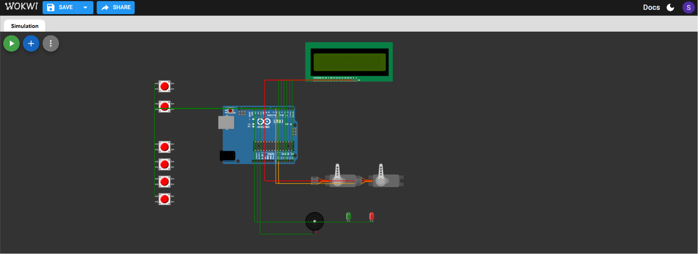
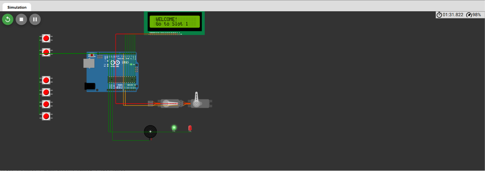
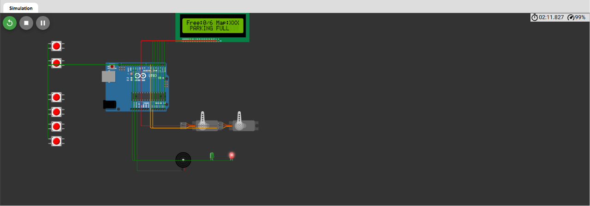
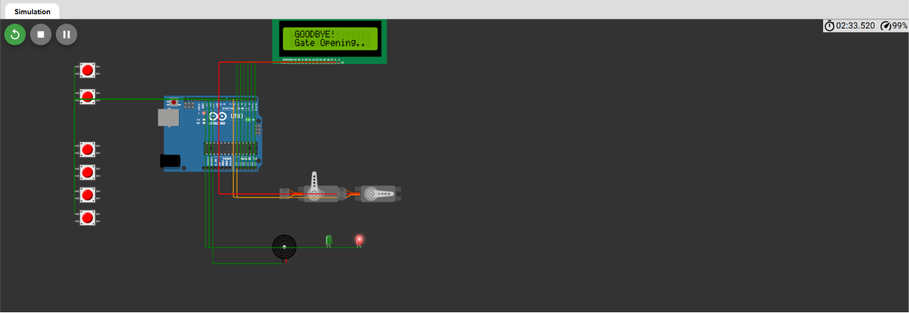
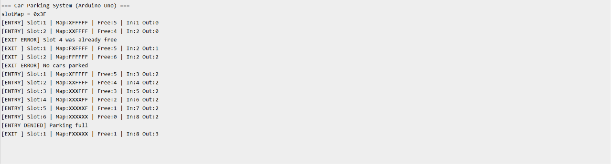

# Automated Car Parking System

An Arduino Uno–based automated car parking system designed to automate vehicle entry, parking slot allocation, and vehicle exit management. The system uses a bitmask-based allocation algorithm to efficiently manage six parking slots, controls entry and exit barriers using servo motors, displays parking information on a 16×2 LCD, and logs system events through the Serial Monitor.

---

## Features

- Automatic parking slot allocation using bitmasking
- Supports 6 parking slots
- IR sensor-based vehicle entry and exit detection
- Servo motor-controlled entry and exit gates
- Real-time parking status on a 16×2 LCD
- Parking full detection and access denial
- Slot validation during vehicle exit
- Audio feedback using buzzer
- Green/Red LED status indication
- Serial Monitor event logging
- Arduino IDE compatible
- Wokwi simulation support

---

## Hardware Components

| Component | Quantity |
|-----------|---------:|
| Arduino Uno | 1 |
| 16×2 LCD | 1 |
| Servo Motor | 2 |
| IR Sensor | 2 |
| Push Buttons | 4 |
| LEDs | 2 |
| Buzzer | 1 |

---

## Pin Configuration

| Arduino Pin | Component |
|-------------|-----------|
| D2 | Entry IR Sensor |
| D3 | Exit IR Sensor |
| D5 | Entry Gate Servo |
| D6 | Exit Gate Servo |
| D7–D10 | Exit Keypad Buttons |
| D11 | Buzzer |
| D12 | Green LED |
| D13 | Red LED |
| A0–A5 | LCD (4-bit mode) |

---

## Project Structure

```text
Automated-Car-Parking-System/
│
├── parking_system.ino
├── diagram.json
├── libraries.txt
├── README.md
└── images/
```

---

## How to Run

1. Open the project in Wokwi.
2. Start the simulation.
3. Press the Entry IR button to simulate vehicle entry.
4. Press the Exit IR button and select the corresponding parking slot.
5. Observe the LCD messages, servo movement, LEDs, buzzer, and Serial Monitor output.

---

## Screenshots

### Overall Simulation



### System Startup


### Vehicle Entry



### Parking Full Condition



### Vehicle Exit



### Serial Monitor



---

## Future Improvements

- RFID-based vehicle authentication
- Automatic billing system
- Cloud database integration
- Mobile application support
- Real IR sensors and hardware implementation

---

## Skills Demonstrated

- Embedded C / Arduino Programming
- Digital Input & Output
- Servo Motor Interfacing
- LCD Interfacing
- Bitmask-Based Memory Management
- Event-Driven Programming
- Embedded System Simulation using Wokwi

---

## License

This project is intended for educational and learning purposes.
